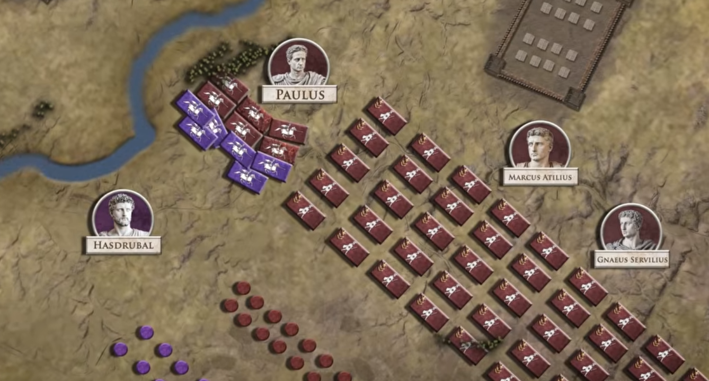

# Canae

An ancient warfare wargame inspired by classic Roman battles. Command infantry, cavalry, and archers across procedurally generated battlefields — solo against AI or head-to-head with friends via peer-to-peer multiplayer.



## Features

- **Solo Play** — Battle against AI opponents with three difficulty levels (easy, normal, hard)
- **Multiplayer** — Real-time peer-to-peer matches using WebRTC (no server required)
- **Procedural Maps** — Unique battlefields generated each game with Perlin-like noise
- **Terrain Effects** — Grass, hills, forests, rivers, mud, and roads each affect movement and combat
- **Unit Types** — Infantry (tanky melee), cavalry (fast flankers), and archers (ranged)
- **Tactical Combat** — Flanking, charging, height advantage, bracing, and morale/routing mechanics
- **Board-Game Aesthetic** — Parchment-style map with a top-down old-world look
- **Mobile Friendly** — Responsive design optimized for landscape phone play and desktop browsers
- **Synthesized Audio** — Sword clashes, arrow volleys, and victory fanfares via Web Audio API

## Getting Started

### Prerequisites

- [Node.js](https://nodejs.org/) (v18+)

### Run Locally

```bash
npm install
npm run dev
```

Open the URL shown in the terminal (usually `http://localhost:5173`).

### Build for Deployment

```bash
npm run build
```

Serve the `dist/` directory with any static file server (e.g. GitHub Pages).

## Controls

| Action | Mouse / Desktop | Touch / Mobile |
|---|---|---|
| Select unit | Click on a friendly unit | Tap a friendly unit |
| Move unit | Click a highlighted tile | Tap a highlighted tile |
| Attack | Click an enemy in attack range | Tap an enemy in attack range |
| Pan camera | Arrow keys or click-drag | Drag |
| Zoom | Scroll wheel | Pinch |
| Focus unit | Double-click a selected unit | Double-tap |

## Tech Stack

- **TypeScript** — Strict, fully typed codebase
- **Vite** — Fast dev server and production bundler
- **Phaser 3** — 2D game framework (rendering, input, scenes)
- **PeerJS** — WebRTC peer-to-peer connections for multiplayer

## Architecture Overview

The project follows a **systems-based architecture** within Phaser's scene lifecycle.

```
src/
├── config/          # Game constants, unit/terrain definitions, settings
├── entities/        # Unit and Terrain data classes
├── systems/         # Core game logic (AI, combat, movement, selection, map, camera, audio)
├── scenes/          # Phaser scenes (Boot → Menu → Battle → GameOver)
├── multiplayer/     # PeerJS connection management and game state sync
├── ui/              # HUD, minimap, unit info panel, combat log
├── utils/           # Shared helpers (clamp, randomInt, manhattan)
└── main.ts          # Phaser game initialization
```

**Data flow:** Configuration defines unit stats and terrain properties → entities are instantiated by systems → systems run each frame within scenes → scenes manage transitions and game state.

See [docs/ARCHITECTURE.md](docs/ARCHITECTURE.md) for a detailed breakdown.

## Future Plans

- Additional unit types (siege engines, war elephants, skirmishers)
- New terrain types and map themes (desert, winter, coastal)
- Campaign mode with linked battles
- Army customization and deployment phase improvements
- Replay system and spectator mode
- Extensible modding support for custom game modes

## License

This project is private.
